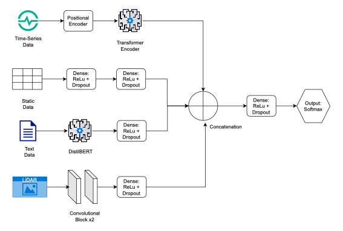
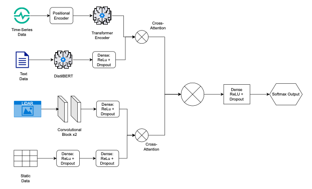

# Multimodal Deep Learning for Credit Scoring

Predicting mortgage loan delinquency by fusing four data modalities -- loan performance time-series, static origination features, LiDAR imagery, and macroeconomic text -- with two different fusion architectures (concatenation vs. learned cross-attention).

## Attribution

This project started as a completed lab from the DataCamp webinar **"Multimodal Deep Learning for Credit Scoring"**, itself adapted from the textbook *[Deep Learning in Banking: Integrating Artificial Intelligence for Next Generation Financial Services](https://www.bankingbook.ml)* by Cristian Bravo, Sebastian Maldonado, and María Óskarsdóttir. All credit for the original problem design, datasets, and model architecture goes to them.

What's in this repository is my own reorganization of that lab: the original single Colab notebook has been refactored into a proper `src/` package (data pipeline, PyTorch dataset, models, training, and evaluation code), with the notebook itself reduced to a documented walkthrough that calls into that package. The modeling results below are from the original lab's run. Original lab/data content follows the original source's own terms; the `LICENSE` in this repo covers only my own code and reorganization.

A **planned extension** (see [Roadmap](#roadmap)) will add an original contribution on top of this foundation.

## Problem

Given a loan's payment history through March 2024, predict whether it will become delinquent at any point in Q2 2024 (April-June). This is a binary classification problem on Freddie Mac single-family loan performance data, sampled down to 50,000 loans for this lab. The positive class (delinquent) is rare -- about 2.4% of the sampled test set -- so this is a class-imbalanced problem where recall on the minority class is usually more business-critical than raw accuracy.

## Data (four modalities)

| Modality | Source | Granularity | Encoder |
|---|---|---|---|
| Time-series | Freddie Mac loan performance extract, Nov 2021-Mar 2024 (29 monthly snapshots) | Per loan | Transformer encoder (2 layers, 4 heads) + sinusoidal positional encoding |
| Static features | Loan origination data: credit score, CLTV, DTI, property type, occupancy, etc. | Per loan | MLP |
| Images | USGS LiDAR imagery | Per metro area (MSA) + ZIP3 | CNN (2 conv blocks) |
| Text | Federal Reserve speech, March 2024 | **Single fixed speech, shared by every loan** | DistilBERT ([CLS] token) |

## Architectures

### 1. Intermediate (concatenation) fusion

Each modality is encoded independently into a 128-dim vector; the four vectors are concatenated and passed through a small fully-connected head.



### 2. Cross-attention fusion

Same four per-modality encoders, but instead of naive concatenation, a custom gated `CrossAttention` module (multi-head attention + learnable sigmoid gate + learnable scale + LayerNorm) lets modality pairs attend to each other in two stages before a learned, softmax-weighted fusion produces the final representation:

- **1st level**: Text ↔ Time-series, Static ↔ Image, Time-series ↔ Static
- **2nd level**: fuses the 1st-level outputs together
- **Fusion**: a learnable weighted sum of the three final representations



## Results

Both models trained with `BCEWithLogitsLoss` + `pos_weight` (to handle class imbalance), AdamW (lr 1e-5), mixed precision, on a held-out 10,000-loan test set:

| Metric | Concat fusion | Cross-attention fusion |
|---|---|---|
| Accuracy | 91.96% | 93.47% |
| Delinquent-class precision | 0.189 | 0.227 |
| Delinquent-class recall | 0.723 | 0.723 |
| Delinquent-class F1 | 0.300 | 0.345 |
| Macro-avg F1 | 0.629 | 0.655 |

Cross-attention fusion improves precision and F1 on the minority (delinquent) class at the same recall, and improves overall accuracy. Both models catch roughly 72% of loans that actually go delinquent, at the cost of a high false-positive rate on the majority class -- a reasonable tradeoff for a use case where missing a delinquency is usually costlier than a false alarm, but one that would need threshold calibration before any production use.

## Known limitations

These are genuine simplifications in the original lab design, not artifacts of the refactor -- worth understanding if you're reading this as a technical reviewer:

- **The text input is identical for every loan.** One fixed Fed speech is tokenized once and reused across all samples. It injects a constant macro-context signal into the fusion layer rather than any per-loan information, so it can't discriminate between loans on its own.
- **Images are geography-level, not loan-level.** LiDAR images are joined by metro area (MSA) + ZIP3 prefix, so many loans in the same area share the same image.
- **Precision on the minority class is low** (19-23%). The model over-predicts delinquency broadly; this is partly a consequence of `pos_weight`-based reweighting rather than resampling or a cost-sensitive threshold, and partly the inherent difficulty of a ~2.4%-positive-rate problem.

## Repository structure

```
├── notebooks/
│   └── multimodal_credit_scoring.ipynb   # narrative walkthrough, calls into src/
├── docs/images/                          # architecture diagrams
├── src/
│   ├── config.py                         # shared constants (columns, seed, paths)
│   ├── data/
│   │   ├── download.py                   # named downloaders for the original lab's data
│   │   ├── time_series.py                # loan loading, delinquency labeling, scaling
│   │   ├── static_features.py            # static feature cleaning/encoding/merge
│   │   ├── images.py                     # MSA/ZIP3 image mapping merge
│   │   └── text.py                       # Fed speech loading + cleaning
│   ├── dataset.py                        # MultimodalDataset (PyTorch)
│   ├── models/
│   │   ├── encoders.py                   # shared per-modality encoders
│   │   ├── fusion_concat.py              # MultimodalDelinquencyModel
│   │   └── fusion_cross_attention.py     # CrossAttention, CrossAttentionFusionModel
│   ├── train.py                          # data assembly + training loop + CLI
│   └── evaluate.py                       # inference, plots, classification report + CLI
└── outputs/                              # checkpoints & generated plots (gitignored)
```

## Setup & usage

```bash
pip install -r requirements.txt
```

The raw data isn't bundled in this repo (it's hosted on Google Drive by the original lab). Download everything with:

```bash
python -m src.data.download
```

Train a model (`concat` or `cross_attention`):

```bash
python -m src.train --model cross_attention --epochs 10
```

Evaluate a checkpoint:

```bash
python -m src.evaluate --model cross_attention --checkpoint outputs/best_multimodal_cross_attention_model.pth
```

Or open `notebooks/multimodal_credit_scoring.ipynb` for the full walkthrough with narrative explanations at each step. The notebook is provided unexecuted (no bundled data/outputs); the results above are from the original lab's run.

## Roadmap

This repo currently mirrors the original lab closely. Planned next: an original extension on top of this foundation -- candidates being discussed include replacing the fixed shared text input with a genuinely per-loan or per-period signal, threshold calibration / cost-sensitive analysis for the precision-recall tradeoff, and model interpretability (e.g. attention weight inspection on the cross-attention model).
